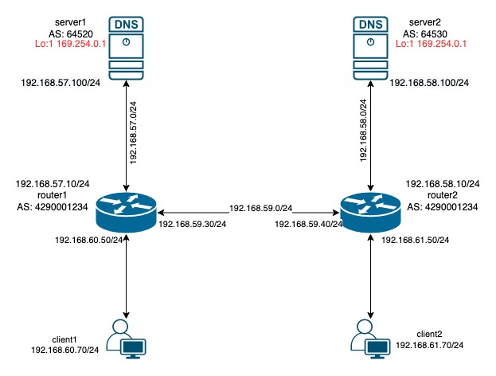

# Project Goal:
The purpose of creating this project is to show the capability of BGP-ANYCAST network.

# Requirments:
1- vagrant  
2- virtualbox  
3- 3 GB memory 

# Network digram:
   

# How to install and run this project:

    #git clone https://github.com/BahmaniAlireza/anycast-bgp-dns.git  
    #cd anycast-bgp-dns   
    #vagrant up  

# How to test it:
As you can see in the diagram above. There are two servers called server 1 and server 2, on each of them the same IP you can ping 169.254.0.1 from each of client machine. is set, which is load balanced by BGP.
you can ping 169.254.0.1 from each client.

    #vagrant ssh client1
  
    vagrant@client1:~$ ping 169.254.0.1  
    PING 169.254.0.1 (169.254.0.1) 56(84) bytes of data.  
    64 bytes from 169.254.0.1: icmp_seq=1 ttl=63 time=1.46 ms  
    64 bytes from 169.254.0.1: icmp_seq=2 ttl=63 time=0.776 ms  
    64 bytes from 169.254.0.1: icmp_seq=3 ttl=63 time=1.08 ms  
  
  
    this traffic goes to server1.
  
    #vagrant halt server1
  
    after shutdown the server1, traffic goes to server2.  
  
    vagrant@client1:~$ ping 169.254.0.1  
    PING 169.254.0.1 (169.254.0.1) 56(84) bytes of data.  
    64 bytes from 169.254.0.1: icmp_seq=1 ttl=63 time=1.46 ms  
    64 bytes from 169.254.0.1: icmp_seq=2 ttl=63 time=0.776 ms  
    64 bytes from 169.254.0.1: icmp_seq=3 ttl=63 time=1.08 ms  

# Use cases:
Best use case of using BGP-ANYCAST is for stateless services such as DNS service.

# Attention: 
*** I haven't installed and configured the dns service yet, please do it yourself. ***
